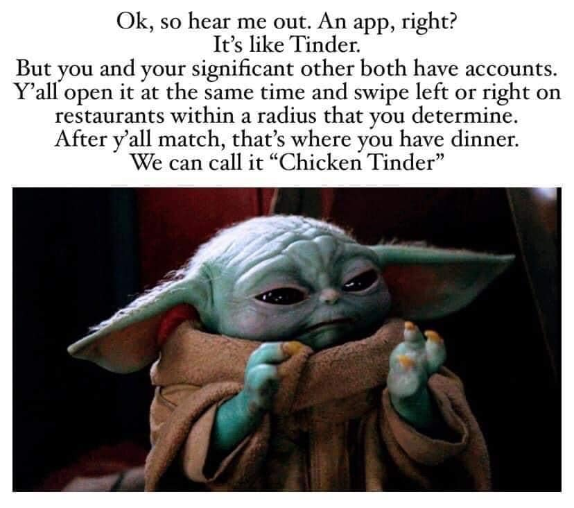
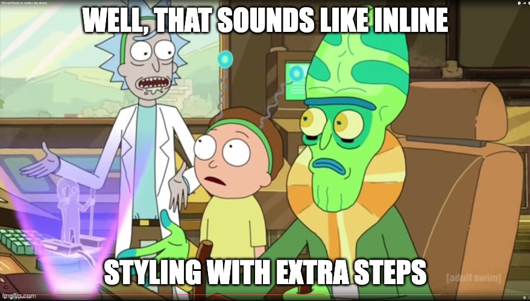

# RestR - Restaurant Matcher

I saw a meme. I had a free evening. I made this.

## Description

RestR is a simple restaurant matching app built with HTML, CSS, and JavaScript. It's "designed" like a good app to teach beginner web developers with. Am considering making a few versions in different languages to highlight differences when using different frameworks.

It uses the Yelp API to retrieve restaurant data and allows users to swipe left or right on cards to indicate whether they like a restaurant or not. When two users both like each other's preferred restaurant, a match is made and the app displays the restaurant information.

Focus was on making a simple app without too many frameworks. The app is built using vanilla JavaScript, Tailwind for styling and uses the Yelp API to retrieve restaurant data. `Express` with `EJS` is used to serve the app. `WS` is used to create a WebSocket server.

## Installation

To install and run this app on your local machine, follow these steps:

1. Clone this repository
2. Navigate to the project directory
3. `npm install`
4. `node server.js`
5. Open the app in your browser by navigating to `http://localhost:3000`.

## Usage

Upon opening the app, users will be presented with a start screen containing a single button to begin the matching process. Clicking the "Start Session" button will take the user to an options page. That will then take you to a session page containing a card with restaurant information and buttons to indicate whether the user likes or dislikes the restaurant.

There is no functionality to share the session, so the user must share the URL with another user to match with them. The user can then swipe left or right on cards to indicate whether they like a restaurant or not.

When two users both like each other's preferred restaurant, a modal will appear displaying the matched restaurant information. The user can then close the modal and continue matching.

## Contributing

If you wish to contribute to this project, please fork the repository and create a new branch for your changes. Once you have made your changes, submit a pull request and explain the changes you have made.

## Credits

This project was started using HTML5 Boilerplate, which is licensed under the MIT License.

HTML5 Boilerplate
https://html5boilerplate.com/

MIT License
https://github.com/h5bp/html5-boilerplate/blob/master/LICENSE.txt

## Things I've learnt

I've learnt that I still don't understand the point of Tailwind. It feels like inline styling.

